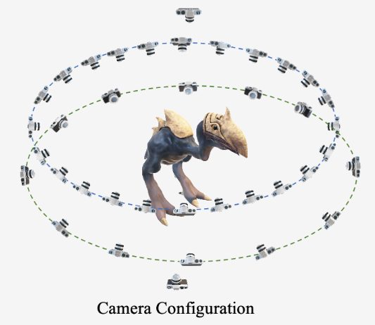

# gobjaverse-lvis

## Overview
Alibaba has released the gobjaverse dataset, which is a high-quality rendering of the Objaverse dataset, comprising 280,000 objects. For each object, there are 40 viewpoints, including two orbits and upper and lower perspectives. [Original G-Objaverse dataset link](https://aigc3d.github.io/gobjaverse/).



Here, we have accomplished two tasks:

First, we took the intersection of the gobjaverse (280K) and objaverse-lvis (48K) datasets to create the gobjaverse-lvis (2.2K) dataset. It's worth noting that in some cases, certain viewpoints for objects in the gobjaverse dataset were missing, and we removed these objects.

We transformed the dataset from the gobjaverse format into the objaverse format.

- The structure of gobjaverse rendering dataset:
```
|-- ROOT
    |-- dictionary_id           # 0-159
        |-- instance_id         # number: e.g. 10075
            |-- 00000
                |-- 00000.json  # Camera Information
                |-- 00000.png   # RGB 
            |-- ...
            |-- 00039
                |-- 00039.json
                |-- 00039.png
```

We need to convert it into the objaverse format:
```
|-- ROOT
    |-- complex_dictionary_id           # 000-000 -> 000-159
        |-- object_id                   # str: e.g. 000a3d9fa4ff4c888e71e698694eb0b0
            |-- pose
                |-- 000.txt
                |-- ...
                |-- 039.txt          
            |-- rgb
                |-- 000.png
                |-- ...
                |-- 039.png   
```

## Steps
#### Setp 1:
**select_280k_lvis.ipynb**：Take the intersection of gobjaverse (280K) and objaverse-lvis (48K) to create gobjaverse-lvis (2.2K).
#### Setp 2:
**check_download_json_error.ipynb**：Check objects with missing or problematic viewpoints and remove them. Finally, obtain **download_280k_lvis_wo_error.json**, which contains the IDs of the cleaned gobjaverse-lvis dataset. You can use this to download the error-free gobjaverse-lvis dataset.
```
python ./download_gobjaverse_280k.py PATH_TO_GOBJAVERSE_LVIS annotations/download_280k_lvis_wo_error.json 10
```
#### Setp 3:
**change_to_objaverse_format.ipynb**：Convert the gobjaverse-lvis dataset from the gobjaverse format to the objaverse format.


## Acknowledgement
```
@article{qiu2023richdreamer,
    title={RichDreamer: A Generalizable Normal-Depth Diffusion Model for Detail Richness in Text-to-3D}, 
    author={Lingteng Qiu and Guanying Chen and Xiaodong Gu and Qi zuo and Mutian Xu and Yushuang Wu and Weihao Yuan and Zilong Dong and Liefeng Bo and Xiaoguang Han},
    year={2023},
    journal = {arXiv preprint arXiv:2311.16918}
}
```
```
@article{objaverse,
    title={Objaverse: A Universe of Annotated 3D Objects},
    author={Matt Deitke and Dustin Schwenk and Jordi Salvador and Luca Weihs and
            Oscar Michel and Eli VanderBilt and Ludwig Schmidt and
            Kiana Ehsani and Aniruddha Kembhavi and Ali Farhadi},
    journal={arXiv preprint arXiv:2212.08051},
    year={2022}
}
```